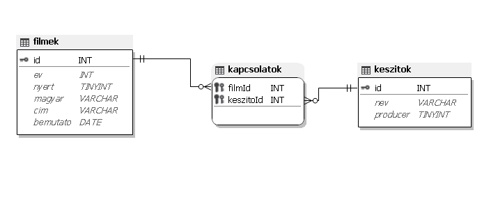
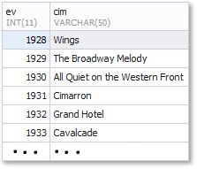

# 3. Oscar-díjas filmek 

Az Oscar-díj az egyik legnagyobb elismerés, amely a filmművészetben létezik. Számtalan
kategóriában ítéli oda az amerikai Filmművészeti és Filmtudományi Akadémia, így például a
legjobb rendező, színész, színésznő. A díjat az előző évben készült filmek egyike nyerheti el.
A hosszas kiválasztási folyamat végén néhány filmet „nominálnak” (jelölnek) a díjra és a zsűri
ezek közül választja ki a legjobbat. Ez az adatbázis a jelölt filmeket tartalmazza. 

---
### Feladatok:
- [1. feladat](#1-készítsen-új-adatbázist-oscar-néven)
- [2. feladat](#2-feladat)

---
## 1. Készítsen új adatbázist oscar néven!

Futtassa le a **oscardijasfilmek.sql** állományt az alábbi táblák(`filmek`, `kapcsolatok`, `keszitok`) létrehozásához és feltöltéséhez

### Táblák:
#### 1. `filmek`

| Azonosító | Típus   | Leírás                                    |
| :-------: | :-----: | :----:                                    |
| id        | int     | A film azonosítója, ez a kulcs            |
| ev        | int     | A film Oscar-díjra jelölésének éve        |
| nyert     | bool    | A film elnyerte-e a díjat                 |
| magyar    | varchar | A film magyar nyelvű címe, ha ismert      |
| cim       | varchar | A film eredeti címe. A címek egyediek     |
| bemutato  | date    | A film magyarországi bemutatójának dátuma |

#### 2. `kapcsolatok`

| Azonosító | Típus | Leírás                            |
| :-------: | :---: | :----:                            |
| filmId    | int   | A film azonosítója, ez a kulcs    |
| keszitoId | int   | A készítő azonosítója, ez a kulcs |

#### 3. `keszitok`

| Azonosító | Típus   | Leírás                            |
| :-------: | :-----: | :----:                            |
| id        | int     | A készítő azonosítója, ez a kulcs |
| nev       | varchar | A készítő neve                    |
| producer  | bool    | A név producerhez tartozik-e      |

## 2. feladat

Készítsen lekérdezést, amely az elismerés évének sorrendjében jeleníti meg az Oscar-díjas
filmeket! Az elnyerés éve és a film eredeti címe jelenjen meg!

