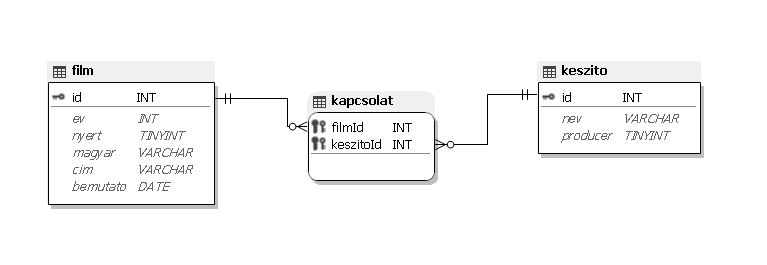

# 3. Oscar-díjas filmek 

Az Oscar-díj az egyik legnagyobb elismerés, amely a filmművészetben létezik. Számtalan
kategóriában ítéli oda az amerikai Filmművészeti és Filmtudományi Akadémia, így például a
legjobb rendező, színész, színésznő. A díjat az előző évben készült filmek egyike nyerheti el.
A hosszas kiválasztási folyamat végén néhány filmet „nominálnak” (jelölnek) a díjra és a zsűri
ezek közül választja ki a legjobbat. Ez az adatbázis a jelölt filmeket tartalmazza. 

---
### Feladatok:
[1. feladat](#1-készítsen-új-adatbázist-oscar-néven)

---
## 1. Készítsen új adatbázist oscar néven!
- Az UTF-8 kódolású szöveges állományokat(`film.txt`, `kapcsolat.txt`, `keszito.txt`) importálja az adatbázisba a fájlnévvel azonos néven (`film`, `kapcsolat`, `keszito`)!
- Az állományok **első** sora a mezőneveket tartalmazza.
- A létrehozás során állítsa be a megfelelő típusokat és az
elsődleges kulcsokat! 

### Táblák:
#### 1. `film`

| id  | ev  | nyert | magyar  | cim     | bemutato |
| :-: | :-: | :---: | :-----: | :-----: | :------: |
| int | int | bool  | varchar | varchar | date     |

#### 2. `kapcsolat`

| filmId | keszitoId |
| :----: | :-------: |
| int    | int       |

#### 3. `keszito`

| id  | nev     | producer |
| :-: | :-----: | :------: |
| int | varchar | bool     |

## 2. feladat
